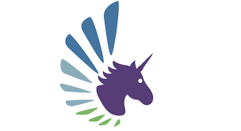

# **Giveth Brand Identity**

Giveth commits to develop an open source Dapp (Decentralized Application), that inspires DACs (Decentralized Altruistic Communities) to connect, transform and empower the world through good causes.

## Dapp and DAC
**Our Brand is represented in two environments: The Dapp vs DAC brand**

Giveth is the Dapp (platform) developed by the Giveth DAC. Both can be viewed as community led projects, not organizations, not charities, not legal entities. The Giveth DAC's mission is to develop the Giveth platform, it is defined by the team's drives and shared values supporting transparency, open-source development and collaborating like-minded projects. The Giveth DAC encourages similar initiatives to co-create and to organize themselves as similar DACs and not competitors; sharing goals and objectives, we all strive to make the world a better place.  

Brand identity is a bundle of mental and functional associations with the Giveth Dapp. Associations are not "reasons-to-donate", but provide familiarity and differentiation that's not replicable.

We aim to create a bundle of mental and functional associations with these keywords:


*   **social good**
*   **humanism**
*   **High Tech/smart**
*   **trust**
*   **transparency**
*   **dream**
*   **honesty**
*   **decentralization**
*   **collaboration**
*   **Innovation**
*   **Community**
*   **Empowerment**
*   **Connection**
*   **Inclusion**

Our uniqueness may come from the fact that neither Giveth DAC, nor the Giveth Dapp  are a legal entity in the traditional sense. Certain secondary properties can be identified: 


*   Diverse and geographically dispersed  team,
*   The team strongly believes in open source development,
*   Decentralization achieved through the the blockchain technology, smart contract development, self governance 
*   Full support for impactful projects and community causes.

_Behind Giveth stands the Giveth DAC:_ The team is  easy going, non-hierarchical, self-organized, task focused and working towards a common goal.  Our designated spokesman is Griff. He gives Giveth an identity  already - one  of collaboration,  making the world a better place, value universal love and  "let's hug, instead of a handshake."

**Brand Vision** _(conveys thinking, feelings and expectations)_

We want to create a unique, iconic, brand identity, that strengthens awareness and motivates the team and community, because they feel proud of being part of Giveth. Our brand vision shall lead to brand loyalty, high credibility and global scalability. 

The Giveth brand invites the community to connect, get involved, create, transform and essentially allows users to become unicorns.  It is friendly, honest and trustworthy, it speaks from the heart. It is responsible, yet chaotic and ensures delivery of the product and service. It is helpful, it wants to remove any barrier to entry. Our brand wants to be related to projects that can scale and offer limitless possibilities to help a good cause. 

## **Brand Culture**

The culture is open and transparent. Communication brings harmony and balance. Giveth social culture is about fairness and fun. 

**Positioning**

We are a community that enables great causes to be supported. We are not a charity organization, there are  no plans for the project to become a traditional legal entity of any sort, yet we operate based on donations as the platform is meant to be completely free to the users. We seek to channel the necessary resources to where they are needed the most and can have the most impact. Compared to other initiatives, our focus is to attract purpose, facilitate the management and enable support for the cause. 

**Personality**

The Giveth DAC  is friendly, informal, at times it may be a bit chaotic, funny (emojis users), committed, speak from the heart, collaborative and community advocates. The language is colloquial and sounds young in spirit.  The Giveth platform is friendly, minimalistic and inclusive, it sends a consistent message of trust and transparency. 

**Relationships**

There is a strong advocacy to support open source and innovative projects and build long term relationships. Skills and experience are often offered to help complete milestones. There is a strong dependency between  Giveth and other initiatives which are still under testing or under development. We aim to facilitate integration and help organizations use the Giveth free, open source platform. 


-------------------------------------------------


## The branding process

**Visual Guide**

Below you'll find a detailed guide on how Giveth branding should be implemented, as well as ideas on how to play with Giveth assets to achieve good visual consistency in official design assets. This slideshow is a great place to start.


<iframe src="https://docs.google.com/presentation/d/e/2PACX-1vRPb9T__ae4HzAW2i9ii776ESLzY9vqWbsRlewgVFr1irIZqE86uR6Q0hDz3lcLIY-KQIs1b-uRzPzp/embed?start=false&loop=true&delayms=3000" frameborder="0" width="480" height="299" allowfullscreen="true" mozallowfullscreen="true" webkitallowfullscreen="true"></iframe>


**Presentations**

Giveth internal will develop a common slide deck with guidelines for anyone to use for any given occasion. Presentations are encouraged to be used at Meetups, conferences and as a mean to appeal to members of the community for donations and to promote specific causes.


-------------------------------------------------


## **Logo, name, symbol**


**Color**

The Giveth colors represent diversity and optimism. Dark Purple and Dark Blue are used as background color with special accent on the cross positioned of various gradients of green and blue. 


**Logo**

Our logo may be the single most important graphic decision we made when developing our brand identity, thanks to Alan Borger and Joana Scarpelini, lead designers, we have a logo that fully represents the Giveth Brand.  As a hallmark for our brand, the logo is best used in launcher sequences, splash screens, and briefly in app bar applications. It is a high-level touchpoint and should be treated as such in the design hierarchy.

**Giveth Dapp Logo**


 


**Giveth DAC logo**





  All assets can be downloaded from the website repo:

  [https://github.com/Giveth/giveth-design-assets](https://github.com/Giveth/giveth-design-assets)


**The Story**

Unicorn Logo: Most Giveth team members love the unicorn concept as it reflects our hopes and dreams, it represents a mystical character. We want Donors to become Unicorns themselves. _Every time a donation is  sent, a unicorn is created._

_Components:_

    UNICORN: The Unicorn can be who they want to be, that's the magical effect of the character.  

    UNICORN'S FINGERPRINTS or WINGS: to symbolize  freedom, identity and transparency. 

	 COLORS: In harmony with the brand colors, they represent diversity and friendliness.

**Logos and UI**


*   Logos should be established in high-level UI elements.
*   Logos shouldn't interfere with the user's interaction patterns
*   Logos or graphics as extensions of the mark are great for brief elements in the UI.
*   Logos can change states to be more adaptable to the experience, e.g. shrinking from the full logo mark to a bug.

-------------------------------------------------

**Tag line**

Building the future of Giving

**Typography**

The Giveth brand identity shall be  futuristic, the effect will be achieved with specific trending typography.   The typography needs to be clear and simple to read, there is a preference for  geometric Google fonts such as: 

EXO

   Giveth.io


   Exo is a contemporary geometric sans serif typeface that tries to convey a technological/futuristic feeling while keeping an elegant design. Exo was meant to be a very versatile font, so it has 9 weights (the maximum on the web) each with a true italic version. It works great as a display face but it also works good for small to intermediate size texts.</span>
   

Quicksand (contender for body, long-format text)

   Giveth.io


   Quicksand is a display sans serif with rounded terminals. The project was initiated by Andrew Paglinawan in 2008 using geometric shapes as a core foundation. It is designed for display purposes but kept legible enough to use in small sizes as well. In 2016, in collaboration with Andrew, it was thoroughly revised by Thomas Jockin to improve the quality.</span>


    


## **Brand Guidelines**

Here are some guidelines to help you use our brand and assets, including our logo, word mark and content without having to ask questions about each use. To make any use of our marks in a way not covered by these guidelines, please contact us at info@giveth.io and include a visual mockup of intended use.


## **Usage**

The Giveth marks include the Giveth name and logo, and any word, phrase, image, or other designation that identifies the source or origin of any of Giveth's work. Please don't modify the marks or use them in a confusing way, including suggesting sponsorship or endorsement by Giveth, or in a way that confuses Giveth with another brand (including your own).


---


## **Logo**

 


---


## **Giveth Logo**

The colored version of the Giveth logo can ONLY be used on a white background. If you are using the Giveth logo on any other background color, use the giveth brand colors, black or white monochrome logo.

When using the Giveth logo with other logos and graphic elements, maintain a safety space that equals 200% the size of the circle around the it. 

We politely ask that you don't:


*   Use any logos or similar imagery to represent Giveth other than what is found in the brand folder
*   Change the colors on logo
*   Overprint or obstruct any part of the logo
*   Add special effects to the logo
*   Use old versions or any other marks or logos to represent our brand


---


## **Visual design of your website or application**


*   Design your site with unique branding and logos. Do not copy or imitate the look and feel of the Giveth website or apps, as this could create user confusion.
*   You must not use, display, mirror or frame (including in meta-tags or hidden text) Giveth websites, or any individual element of Giveth websites, Giveth's name, word-marks, logos or other proprietary information, or the layout and design of any page or form contained on a page.


---


## **Naming**


*   You're entitled to say that your website or application is integrated with Giveth (we like people integrating with Giveth!), but please don't use the Giveth marks as part of the name of your company, application, product, or service, or in any logo you create. 


---


## **Merchandise**


*   We love the use of our marks on merchandise, specifically T-shirts. However, please do not use the Giveth name, the Giveth logo, or any other confusingly similar marks on any apparel, product, toy, or any other merchandise, unless approved by the Giveth DAC.


---

## **CSS**

This template code can be used with Bootstrap4 websites and web-apps to set button, navbar styling and specify body and headline fonts:

```  
.navbar {
    background-color: #2c0d54 !important;
    filter: alpha(opacity=70);
    opacity: 0.9;
  }

* {
  font-family: 'Raleway', sans-serif;
  font-size: 18px;
  font-weight: 400;
}

h1, h2, h3, h4, h5, h6, .logo-font {
  font-family: 'Raleway', sans-serif;
  font-weight: 300;
  text-align: center;
  color: #2c0d53;
}

.btn {
  background-color: #2c0d54;
  border-color: #2c0d54;
}
```


---


## **General Info**

By using the Giveth marks you agree to follow these guidelines. Giveth may change, cancel, or modify the permission in these guidelines at any time. For further information about use of the Giveth name and trademarks, please contact info@giveth.io


**Notes:**


<table>
  <tr>
   <td> 
   </td>
   <td>Brand Identity
   </td>
   <td>Brand Image
   </td>
  </tr>
  <tr>
   <td>1
   </td>
   <td>Brand identity develops from the source or the company.
   </td>
   <td>Brand image is perceived by the receiver or the consumer.
   </td>
  </tr>
  <tr>
   <td>2
   </td>
   <td>Brand message is tied together in terms of brand identity.
   </td>
   <td>Brand message is untied by the consumer in the form of brand image.
   </td>
  </tr>
  <tr>
   <td>3
   </td>
   <td>The general meaning of brand identity is "who you really are?"
   </td>
   <td>The general meaning of brand image is "How market perceives you?"
   </td>
  </tr>
  <tr>
   <td>4
   </td>
   <td>It's nature is that it is substance oriented or strategic.
   </td>
   <td>It's nature is that it is appearance oriented or tactical.
   </td>
  </tr>
  <tr>
   <td>5
   </td>
   <td>Brand identity symbolizes firms' reality.
   </td>
   <td>Brand image symbolizes perception of consumers
   </td>
  </tr>
  <tr>
   <td>6
   </td>
   <td>Brand identity represents "your desire".
   </td>
   <td>Brand image represents "others view"
   </td>
  </tr>
  <tr>
   <td>7
   </td>
   <td>It is enduring.
   </td>
   <td>It is superficial.
   </td>
  </tr>
  <tr>
   <td>8
   </td>
   <td>Identity is looking ahead.
   </td>
   <td>Image is looking back.
   </td>
  </tr>
  <tr>
   <td>9
   </td>
   <td>Identity is active.
   </td>
   <td>Image is passive.
   </td>
  </tr>
  <tr>
   <td>10
   </td>
   <td>It signifies "where you want to be".
   </td>
   <td>It signifies "what you have got".
   </td>
  </tr>
  <tr>
   <td>11
   </td>
   <td>It is total promise that a company makes to consumers.
   </td>
   <td>It is total consumers' perception about the brand.
   </td>
  </tr>
</table>
