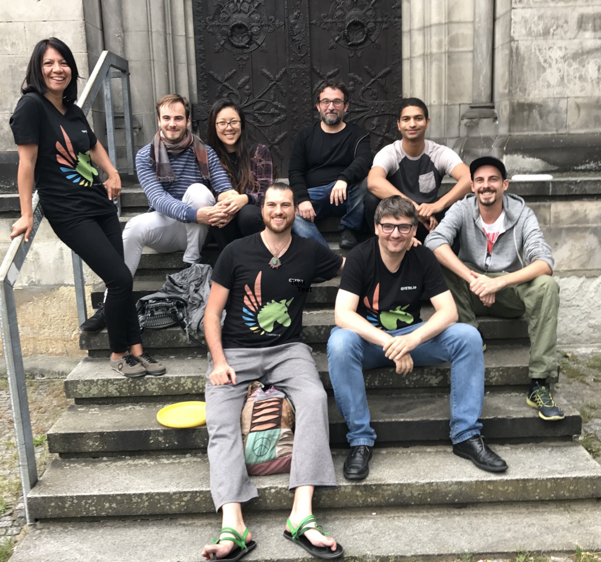

# About Giveth

The Giveth Core Team is an eclectic mix of people from the Ethereum and nonprofit worlds. They are dedicated to building the tools that will make it easy for anyone to build a global community around a cause. In fact, this core team is using the Giveth Platform to build a community around the Giveth idea itself! If you want to help create the solution, join our [Slack](http://slack.giveth.io/)

We are Altruistic, we are entirely open-source and love to reach out proactively to similar initiatives, which we see as potential collaborators as opposed to competitors. The Unicorn DAC works with volunteers, and genius developers who are working for a fraction of what they could be earning at for-profit Ethereum projects.

We are a Community. The individual members of the Unicorn DAC call themselves Unicorns and are a rag tag group of white hat hackers and social pioneers trying to make the world a better place. Our common goal is to develop the Giveth platform, the team’s drive is defined as supporting transparency, open-source development, co-creation and collaboration.

We are moving towards a fully Decentralized governance system. We have been using our PoC DApp to compensate the team members’ efforts in a way that shows milestone achievements towards the common vision. We believe in the self-organizing power of holacracy, which we apply in the organization of tasks, our Slack channels and during our governance meetings.

## What is a DAC?

DAC stands for 'Decentralized Altruistic Community' and is a meta-description for anybody engaging in a process to alleviate some problem in this world with time and effort.

## Can I see a picture?

