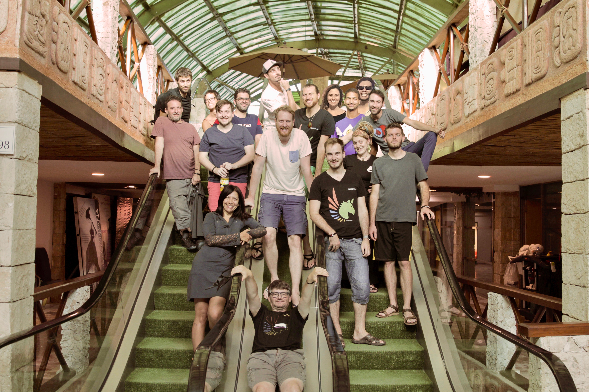

# About the Giveth DAC

Giveth is a community of Makers that is building the Giveth Galaxy, our ever-extending collection of initiatives that is driving Blockchain for Good innovation. Giveth strives to model the DAC concept as one of the first non-profit blockchain based entities. If you would like to contribute please get involved by taking a look at our [Contributors Guide](../dac/contributors-guide).

The Giveth Decentralized Altruistic Community (DAC) is an eclectic mix of people from the Ethereum and nonprofit worlds. They are dedicated to building the tools that will make it easy for anyone to build a global community around a cause. In fact, this core team is using the Giveth Platform to build a community around the Giveth idea itself! If you want to help create the solution, **join our [community](http://join.giveth.io)**

We are Altruistic, we are entirely open-source and love to reach out proactively to similar initiatives, which we see as potential collaborators as opposed to competitors. The Giveth DAC works with volunteers, and genius developers who are working for a fraction of what they could be earning at for-profit Ethereum projects. To help us in building Giveth, **please visit the [contributors guide](../dac/contributors-guide/)**

We are a Community. The individual members of the Giveth DAC call themselves Unicorns and are a rag tag group of white hat hackers and social pioneers trying to make the world a better place. Our common goal is to develop the Giveth platform, the team’s drive is defined as supporting transparency, open-source development, co-creation and collaboration. See **[Team Organization](../dac/team-organisation/) for more information.**

We are moving towards a fully Decentralized governance system. We have been using our different iterations of our DApp to compensate the team members’ efforts in a way that shows milestone achievements towards the common vision. We believe in the self-organizing power of holacracy, which we apply in the organization of tasks, our Slack channels and during our governance meetings. **Visit [Governance model](../governance/) for more information.**

## What is a DAC?

DAC stands for 'Decentralized Altruistic Community' and is a meta-description for anybody engaging in a process to alleviate some problem in this world with time and effort. **Read more [here](https://medium.com/giveth/giveth-introduces-decentralized-altruistic-communities-dacs-d1155a79bdc4).**

To find out more about how the Giveth is currently functioning please make sure to look through **the [welcome](../index.md), [mission](../dac/mission) and [goals](../dac/goals) pages :)**
