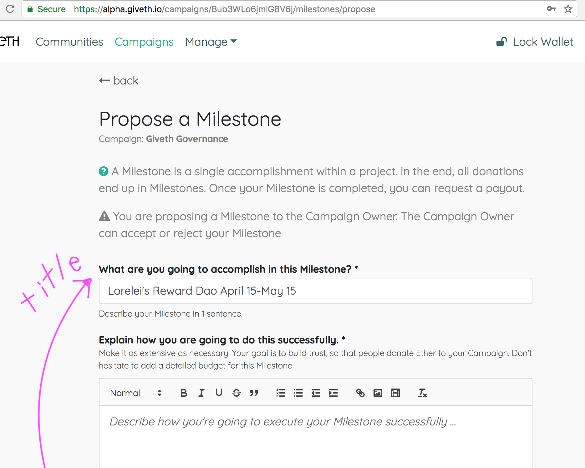
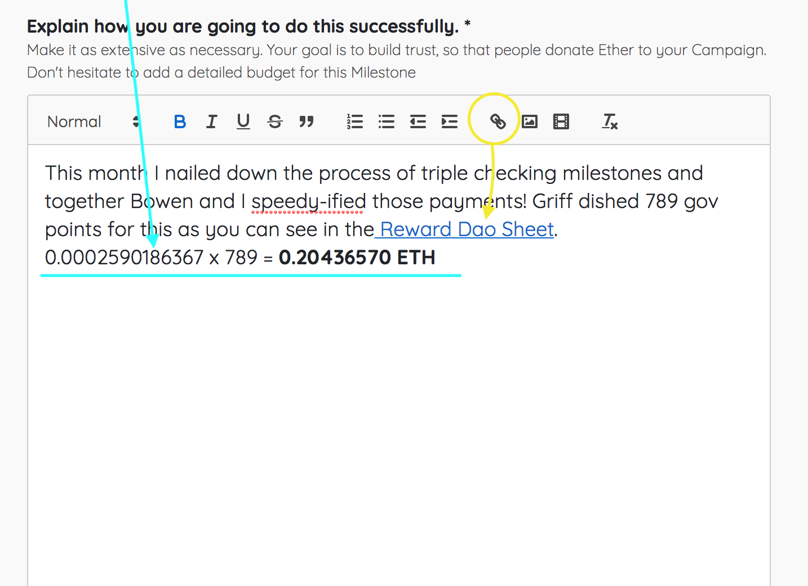
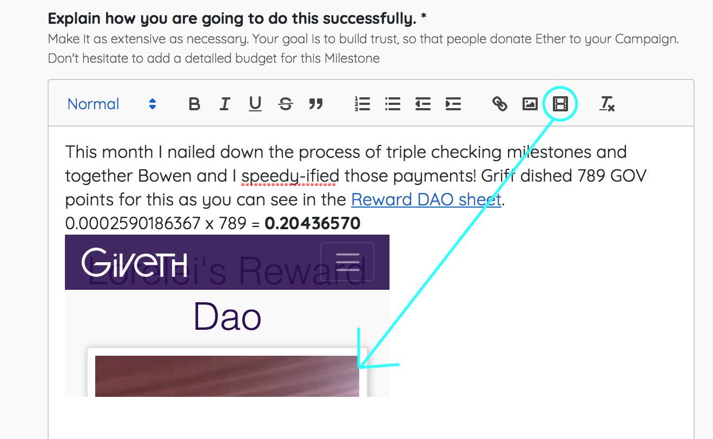
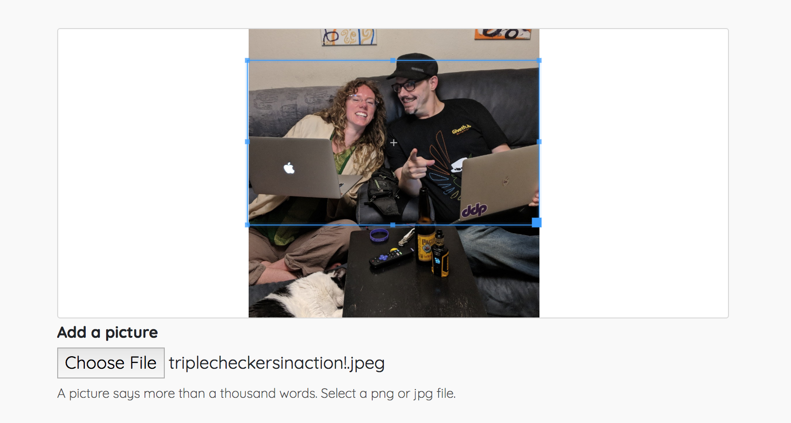
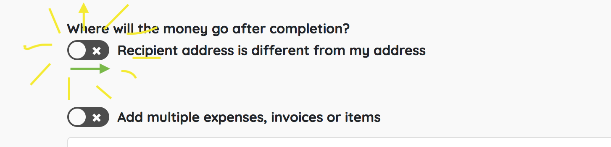
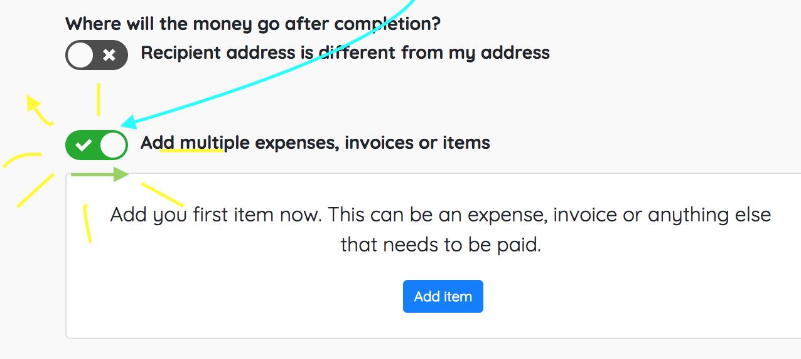
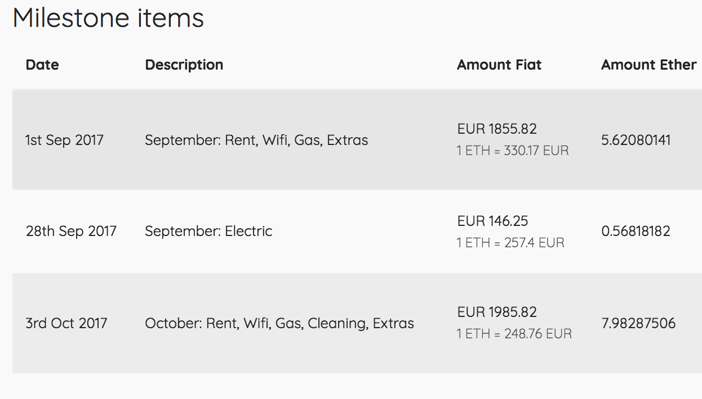

# How to Make a Milestone!
Welcome! If you are super new to Giveth, join the [Contributors channel](https://riot.im/app/#/room/#giveth-contributors:matrix.org) on Riot. You can introduce yourself and ask questions there!

This is a living document and will change as bugs are fixed and features added to the DApp. Feel free to contribute to this tutorial!

1. Go to beta.giveth.io and select which campaign your milestone is for.
2. From the campaign page, click “Propose Milestone” which will take you to this page: 

     

3. Create a title! Include the type of milestone (Regular Reward? Reward Dao? Bounty? Expense Reimbursement?), date of the work, and ideally, the name of the recipient.
4. From this point on, consider copying all of your milestone text to a place where you keep your own records. If your reviewer declines to review this milestone, or if it gets caught in the process for any reason, you will have to re-propose the milestone anew.
5. Share a little about what you are being paid for. Include proof of work or expenses. You can link to github pages, other documents you worked on, or upload photos of receipts. Show your calculations. 
     
For Reward DAO, embed your Wall of Fame video! 
    	
If you are listing large sums of money, use standard American denotation rather than european. (e.g: One thousand euro and 55 cents should be 1,000.55 not 1.000,55)
6. Add a photo for your milestone. It can be related to the work, or not! 
    
7. Select a Reviewer, and think about who will be the best for the job. The Reviewer is responsible for ensuring that all steps in the milestone have been completed and accomplished, and that it makes sense and is beautiful, before the milestone should be paid out. If possible, choose a different person than the campaign manager. Having the campaign manager, reviewer, and proposer (you) be 3 different people helps ensure against mistakes being overlooked, but the most important thing is that the people approving your milestone understand the work. 
8. If you are proposing OR EDITING a milestone for someone else, be sure this switch is toggled on and you set the correct address for the recipient! 
    
For Reward DAO, use the address listed on the contributor’s Wall of Fame video. For any others you aren’t sure about, ask a Unicorn on riot for a list of verified addresses of Givethers.  
9. Set the milestone date to the day of ETH/FIAT conversion. 
a)  Reward Dao: Always on the 15th of the month, at the end of the points period.  
b) Regular Rewards: On the Sunday of the end of the week you are claiming rewards for. 
c) Bounty: date doesn’t matter so much because there is no conversion (bounties are denominated in eth and payed out in eth), but keep it around the time the work was completed! 
d) Expenses: If you have multiple expenses bought on different days that you are claiming in one milestone, toggle this switch on. 
    
Then you will itemize the dates according to their respective receipts, like so: 
    

10. Click “Propose Milestone” and now monitor your milestone’s progress from the “My Milestones” page. Once your campaign manager approves it, it’s status will read “In Progress.” It’s now your turn to mark it complete, which will push it to the reviewer and status says “Needs Review.” If any of these processes are moving slowly or you notice it went backwards from “Needs Review” to “In Progress,” (this is how it will look to you if the reviewer rejects the milestone) check in with your reviewer. 
