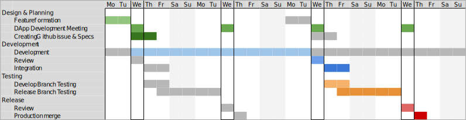
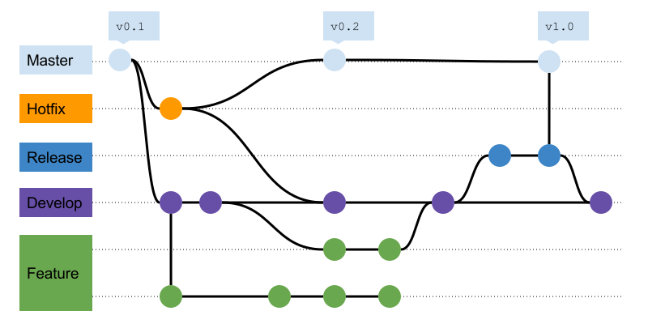
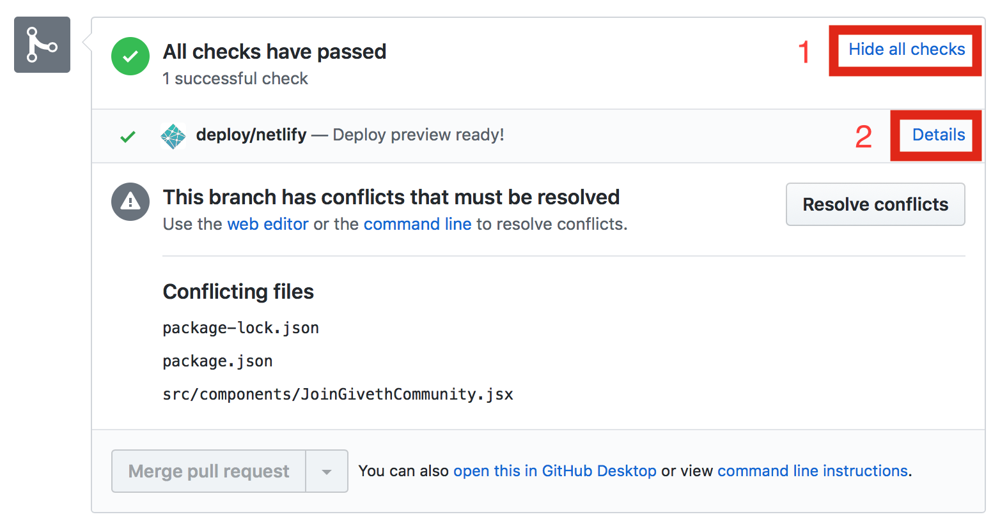

# Development, Testing, Quality Assurance and Deployment
This chapter details the development process, the deployment setup, how new features are included, tested and how quality assurance is handled. The aim is to provide answers to questions, like how are new features decided, what is the deployment setup, git organization and how are new changes introduced and tested.


<a name="product-development-testing-fig-release">**The Product Development Cycle**</a> spans 4 weeks and consists of 1 week of planning, 2 weeks of development, and 1 week of integration, testing and release. The cycle is repeated every 2 weeks which means there is new release every 2 weeks and the new feature development is continuous.

## Design & Development Planning
The development loosely follows the [product definition outlined in the wiki page](../product-definition/). The planning is decided and presented every second week during the weekly [DApp Governance and Development Meeting](https://calendar.google.com/calendar/embed?src=givethdotio%40gmail.com) which is open for anyone to attend. The rough development plan can be found in the [product roadmap page](../product-roadmap) and the more detailed in the [repository board](https://github.com/Giveth/giveth-dapp/issues#boards?repos=98920496,99012473) (you may need to install ZenHub).


## Deployments and Branch Organisation
At Giveth, we are using the [gitflow](http://nvie.com/posts/a-successful-git-branching-model/) branching model to deploy to 4 different environments.

Name | Blockchain | Branch Deployed | Auto Deploy | Use |
-----|------------|-----------------|-------------|-----|
[mainnet](https://mainnet.giveth.io) | Ethereum Main Network | master | no | Main network deployment for now abandoned due to high transaction costs until sustainable solution is found.
[alpha](https://alpha.giveth.io)  | Rinkeby Test Network | master | no | Environment used as a production version until scalability is resolved.
[release](https://release.giveth.io) | Rinkeby Test Network | release | yes | Environment for release candidate quality control testing by non-devs.
[develop](https://develop.giveth.io) | Rinkeby Test Network | develop | yes | Development environment for integrating new features. Feature and pull request branches are also automatically deployed to this environment.

The gitflow model allows us to iteratively develop the DApp while maintaining high quality standards. The model defines several branches and works well for a release based software workflow.

Name | Description |
-----|------------|
master | The master branch tracks released code only. The only commits to master are merges from release branches and hotfix branches.
release | The code in the release branch is deployed onto a suitable test environment, tested, and any problems are fixed directly in the release branch. This deploy -> test -> fix -> redeploy -> retest cycle continues until the release is good enough to release to production. When the release is finished, the release branch is merged into master and into develop too, to make sure that any changes made in the release branch aren’t accidentally lost by new development.
develop | As new development is completed, it gets merged back into the develop branch, which is a staging area for all completed features that haven’t yet been released. So when the next release is branched off of develop, it will automatically contain all of the new features that has been finished.
feature | Feature branches are branched off of the develop branch, and finished features and fixes are merged back into the develop branch when they’re ready for release.
hotfix | Hotfix branches are branched of master and contain emergency fixes only. They are merged to both develop and master.


**Example of a gitflow workflow.** Almost every git GUI software has gitflow functionality build it which automatically follows the gitflow workflow.

You can read more in depth in [this atlassian gitflow article](https://www.atlassian.com/git/tutorials/comparing-workflows/gitflow-workflow).

Before making new Pull Request, make sure that your code does not have any linter issues and can be deployed. Only PRs that successfully deploy and don't have any merge conflicts will be merged. You can also easily check the deploy preview on Github Netlify autodeploy integration.

**Deployment preview.** Each pull request to the DApp repository has a Netlify deploy preview. You can access it at the bottom of the Conversation tab after clicking **Show all checks** button and **Details**.

## Integration & Testing
Integration of new features is done by the **development team** after a DApp dev meeting where PRs are reviewed. After the PRs are reviewed and fixed, they are merged to the develop branch. Testing of the new features is done in the [`develop`](https://develop.giveth.io) environment to ensure the features do what they say and work well with the rest of the DApp. The deadline for new features to be included is every second Wednesday 12:00 GMT+1. You can see the deadlines in [Giveth Calendar](https://calendar.google.com/calendar/embed?src=givethdotio%40gmail.com).

## Quality Assurance Testing
After new features are integrated and tested in the [`develop`](https://develop.giveth.io) environment, they get merged and deployed to the [`release`](https://release.giveth.io) environment. The QA testing takes time over weekend and is guided by [corresponding procedure](https://drive.google.com/drive/folders/1_wzYp-Clb2VZGR201hUmiFSAL4tgHcll?usp=sharing) which also serves as collection system for testing reports. The QA testing is open to outside contributors and should not be done by the development team. New testing is triggered by posting new testing procedure to the `#alpha_testing` channels on Slack and Riot. 

## Production Deployment
Only once all the newly introduced bugs are removed in the release branch, the release can be merged to master and pushed to production. It is done manually by DApp devteam (by `@perissology` and `@vojtech`). If there are no issues, the deployment should take less than 5 minutes:

First, deploy the newest version of feathers-giveth 
```
$ ssh user@feathers.alpha.giveth.io

$ cd /home/deploy/feathers-giveth/
$ sudo -u deploy bash

$ git pull

$ yarn install --pure-lockfile
$ yarn serve
```

Next, check the feathers deploy status
```
$ pm2 logs
```

If the logs are clear, the last step is to deploy the latest master branch commit on [Netlify](http://netlify.com/) and locking the deploy.

## FAQ
**What is the deadline for new features to be included?**

The deadline is every second Wednesday 12:00 GMT+1. You can see the deadline in [Giveth Calendar](https://calendar.google.com/calendar/embed?src=givethdotio%40gmail.com).

 **What is the definition of a feature?**

Feature is any non-trivial improvement (less than 10 lines of code). Most features have issue in the corresponding Github Repository.

 **What about fixes?**

 Big non-critical fixes are treated just as any other feature. If a fix is time critical, it is created as new branch with `hotfix/` prefix as a fork from the `master` branch. Such hotfix is tested at minimum by 2 people from dev team before being merged to `master`, `develop`, and `release` branches.

 **Where do we communicate what needs testing?**

The QA testing is announced in the `#alpha_testing` channel and guided by [corresponding testing procedure](https://drive.google.com/drive/folders/1_wzYp-Clb2VZGR201hUmiFSAL4tgHcll?usp=sharing). The header in each procedure should specify what needs to be tested.

 **Who performs the tests and how much time it takes?**

 The development testing is done by the dev team for maximum of 2 days after DApp integration meeting on Wednesday. The QA testing is done by contributors from the `#alpha_testing` channel after the integration testing. It starts on Friday at latest and is made iteratively until all the issues are resolved and tested. There is a test review next Wednesday and release to production if it did not happen before.

**How do we prioritize when tests fail / bug fixes?**

Bug fixes are done ad-hoc as soon as discovered during the testing process. The bugs can be tackled by DApp dev team or external contributors can be asked to help. Bug fixing has a priority over new development.

**Who and how deploys?**

The `develop` and `release` branches are autodeployed to their environments. The `master` branch is deployed by the dev team (`@vojtech` and `@perissology`) once there are no new known bugs in the `release` branch. The process is manual and there is a deployment procedure.
 
**What is the release cycle frequency?**
 
 There is new release every 2 weeks as depicted in the [product development cycle gant chart](#product-development-testing-fig-release).
