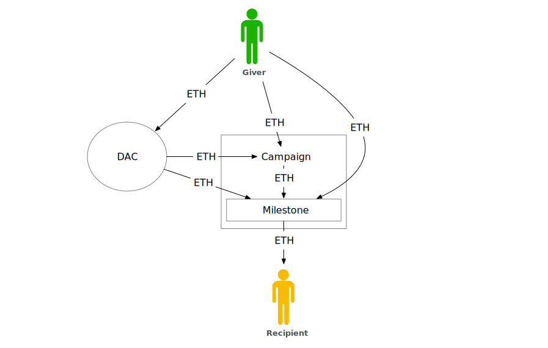
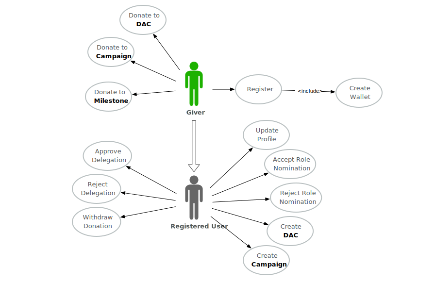
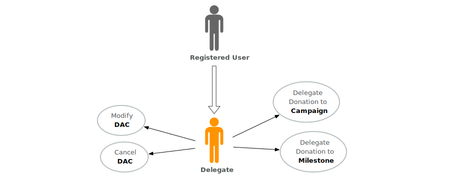
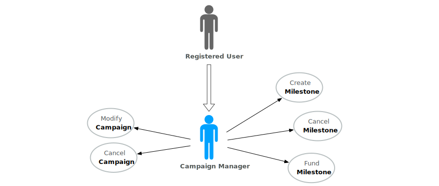
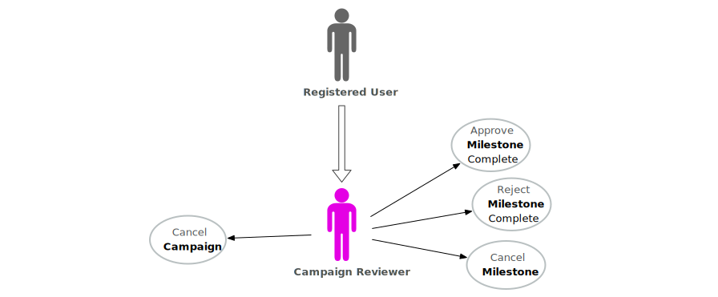
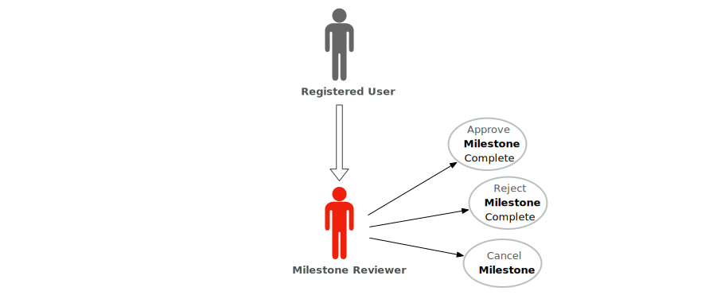
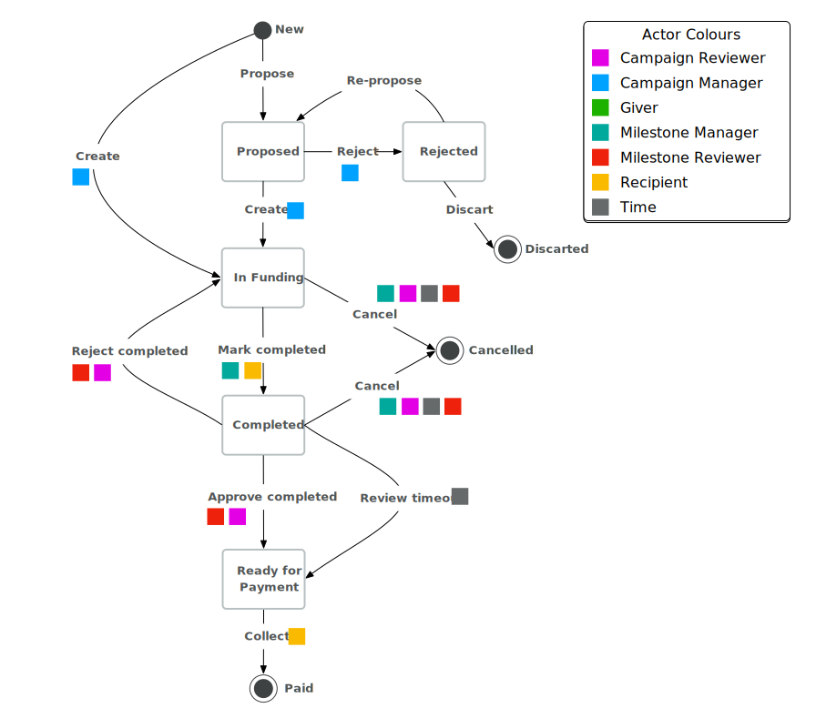

# Product Definition

The Giveth platform is currently in a minimal viable product (MVP) state, and will allow users to give Ether contributions to Communities organized around causes. The system is a set of [smart contracts](https://github.com/Giveth) living on the [Ethereum blockchain](https://ethereum.org), with a [caching server](https://github.com/Giveth/feathers-giveth) middle-layer and a [graphical user interface (GUI)](https://github.com/Giveth/giveth-dapp). Currently we are in closed alpha testing, should you be interested to help us test the system, please contact `@vojtech` in the [Giveth community](http://join.giveth.io/).

## Executive Summary

The system consists of:

- [**DACs**](#product-definition-dac) short for Decentralised Altruistic Community. Every DAC is a Community built around a cause to which users can donate. A DAC is owned by a Delegate who can delegate the donations to Campaigns linked to the DAC.
- [**Campaigns**](#product-definition-campaign) are individual projects which are owned by a Campaign Manager. These projects have Milestones through which the Campaign can get funding.
- [**Milestones**](#product-definition-milestone) can be created within a Campaign and are the only way to get donations out of the Giveth system. Milestones can be proposed by the Campaign Manager and follow a workflow where multiple people can interact with it, to ensure the Milestone has been accomplished.

**There are 7 roles:**

- [**Campaign Manager**](#product-definition-campaign-manager) is the sole owner of a Campaign and can fund a Milestone with donations delegated to the Campaign.
- [**Campaign Reviewer**](#product-definition-campaign-reviewer) can cancel Campaigns and oversee completion of any Milestone within the Campaign.
- [**Delegate**](#product-definition-delegate) is the sole owner of a DAC and can delegate money from the DAC to a Campaign or a Milestone within the Campaign.
- [**Giver**](#product-definition-giver) gives (donates) funds (Ether) to a DAC, Campaign or a Milestone.
- [**Milestone Manager**](#product-definition-milestone-manager) is responsible for making sure that a Milestone is accomplished.
- [**Milestone Reviewer**](#product-definition-milestone-reviewer) reviews the completion of a Milestone.
- [**Recipient**](#product-definition-recipient) receives donations upon completion of Milestones.

Please note: Any entity within the Giveth system is represented by an Ethereum address. For now these are simple accounts created upon registration; eventually, these roles could be filled by a multisig, oracle, DAO, etc.

## Giveth in Depth

Lets have a second, more in-depth, look at the Giveth system. There are 3 distinct entities in the system which are handling the flow of donations. The relations between them are depicted in [Figure 1](#product-definition-fig-relations). Each of these 3 entities corresponds to one or more smart contracts.

<a name="product-definition-fig-relations">Figure 1</a>: **Relationships between DACs, Campaigns and Milestones.** DACs and Campaigns can be linked with each other, but can also exist as stand-alone entities without more complex relations. Special rules apply to Milestones: Every Milestone can be linked to exactly one Campaign, but multiple Milestones can exist in one Campaign. A Milestone can not exist by itself without a parent Campaign.

### <a name="product-definition-giver">Giver</a>

Before we dive in the different entities, lets briefly talk about arguably the most important users in our system - Givers. The term Giver describes anyone who used our platform to give donations to a DAC, Campaign or a Milestone. You can see all possible versions of how funds flow in the system ([Figure 2](#product-definition-fig-money-flow)). Givers can interact with these 3 entities, but they are not explicitly part of any, unless they choose to join a DAC or assume another role as well. The 'roles locality' can be observed in [Figure 3](#product-definition-fig-role-locality). The full list of a Giver's possible interaction with other roles is depicted in the 'use case diagram' in [Figure 4](#product-definition-fig-giver-usecase).

<a name="product-definition-fig-money-flow">Figure 2</a>: **Donation flow within the Giveth system.** A Giver can give ETH to a DAC, a Campaign or directly to a Milestone. From a DAC the money can be delegated to a Campaign and from a Campaign donations can be locked in a Milestone within the Campaign the funds were donated to. The only way for a Recipient to move funds out of the system is by successfully completing a Milestone.

<a name="product-definition-fig-role-locality">Figure 3</a>: **The locality of roles.** All roles have a limited scope and once an entity seizes to exist, so do the connected roles. Every DAC contains exactly one Delegate, every Campaign has one Campaign Manager and Campaign Reviewer and every Milestone has a Milestone Manager, a Milestone Reviewer and a Recipient. The Giver is not explicitly associated with any entity, but may interact with all of them.

<a name="product-definition-fig-giver-usecase">Figure 4</a>: **Use case diagram** showing all possible actions for [Givers](#product-definition-giver).

### <a name="product-definition-dac">DAC</a>

DACs (Decentralised Altruistic Communities), are the most general entity in the Giveth System. The purpose of a DAC is to unite Givers around a cause and provide them with the possibility to give money to a cause without having to research the exact Campaigns, destined to make a change. Any money donated to a DAC can be retrieved by the Giver, however we strongly discourage Givers to do so. The funds remain in the DAC until they are taken back by the Giver, or delegated to either a Campaign or a Milestone.

#### <a name="product-definition-delegate">Delegate</a>

A Delegate is a registered user owning a DAC. They can delegate the funds donated to their DACs. The 'use case diagram' in [Figure 5](#product-definition-fig-delegate-usecase) shows all possible actions a Delegate can take. Currently, in the MVP version of Giveth, donations can not be split, hence any donation needs to be fully delegated with the total amount to a Campaign or a Milestone. A delegation is a process, where the donation pledged to a DAC is transferred to a Campaign or Milestone. Once delegated, the Giver has 3 days to reject the delegation. After that time, the money is locked in the Campaign or Milestone to which the money was delegated. This process is visualised in [Figure 6](#product-definition-fig-dac-campaign-donation-statediagram) for delegating to a Campaign and in [Figure 7](#product-definition-fig-dac-milestone-donation-statediagram) for delegating directly to a Milestone.

<a name="product-definition-fig-delegate-usecase">Figure 5</a>: **Use case diagram** with all the actions the [Delegate](#product-definition-delegate) can take.

<a name="product-definition-fig-dac-campaign-donation-statediagram">Figure 6</a>: **State diagram for DAC -> Campaign delegation flow**, showing how donations made to a DAC are delegated to a Campaign.

<a name="product-definition-fig-dac-milestone-donation-statediagram">Figure 7</a>: **State diagram for DAC -> Milestone delegation flow**, showing how donations made to a DAC are delegated directly to a Milestone.

### <a name="product-definition-campaign">Campaign</a>

In the Giveth System, a Campaign represents one or more individual project(s) which take action to make a change in the world. Donations made to a Campaign are locked and unless the Campaign gets cancelled, the Giver no longer has control over the donation. The reasone why we lock the donations, is to give the people behind the Campaign some level of certainty that they can count on getting the pledged donations and pledge them to one of their Milestones. The previously mentioned [Figure 6](#product-definition-fig-dac-campaign-donation-statediagram) describes the donation flow from a DAC to a Campaign and [Figure 10](#product-definition-fig-campaign-donation-statediagram) shows the state diagram for direct donations to a Milestone.

#### <a name="product-definition-campaign-manager">Campaign Manager</a>

A Campaign Manager is a registered user who has created a Campaign (and therefore acquires sole ownership of the new Campaign). The role of the Campaign manager is to create Milestones through which they can fund the work of people and cost of resources behind the project. [Figure 8](#product-definition-fig-campaign-manager-usecase) depicts all the actions a Campaign manager can take.

<a name="product-definition-fig-campaign-manager-usecase">Figure 8</a>: **Use case diagram** with all possible actions the [Campaign Manager](#product-definition-campaign-manager) can take.

#### <a name="product-definition-campaign-reviewer">Campaign Reviewer</a>
Because donations to a Campaign are locked, we have added a Campaign Reviewer role to give some oversight over the Campaign's progress. A Campaign Reviewer is a registered user who has the power to reject a Milestone's completion (set goal unfulfilled), cancel Milestones (duplicates, prevent fraud) and even cancel a Campaign if necessary (to prevent fraud). You can see all possible actions for Campaign Reviewers in [Figure 9](#product-definition-fig-campaign-reviewer-usecase).

<a name="product-definition-fig-campaign-reviewer-usecase">Figure 9</a>: **Use case diagram** with all possible actions a [Campaign Reviewer](#product-definition-campaign-reviewer) can take.

<a name="product-definition-fig-campaign-donation-statediagram">Figure 10</a>: **State diagram for donations made to Campaign.**

### <a name="product-definition-milestone">Milestone</a>

Milestones can be created within a Campaign and are the only way to get donations out of the Giveth system. Givers can donate money directly to a Milestone: The actual donation flow is very simple and is depicted in [Figure 14](#product-definition-fig-milestone-donation-statediagram).

Milestones require a specific workflow, where several roles have to work with the Milestone in order for it to be completed and for the donated funds to transfer ownership to the Receiver and allow the donations to be taken out of the Giveth system (see [Figure 15](#product-definition-fig-milestone-statediagram)). Each Milestone has a completion date, by which it needs to be completed or it will be cancelled.

Required information upon creation of a Milestone are:
  - requested amount of Ether
  - description of conditions to be fulfilled to complete the Milestone.

#### <a name="product-definition-milestone-manager">Milestone Manager</a>

A Milestone Manager is a registered user who has been nominated by the Campaign Manager. The role of the Milestone Manager is to make sure the work and the status described in the Milestone has been achieved. Once a state of completion has been achieved, the Milestone Manager needs to mark the Milestone complete. Should there be any major issues, they have the power to cancel the Milestone.

<a name="product-definition-fig-campaign-manager-usecase">Figure 11</a>: **Use case diagram** with all possible actions a [Milestone Manager](#product-definition-milestone-manager) can take.

#### <a name="product-definition-milestone-reviewer">Milestone Reviewer</a>

Because direct donations by Givers to a Milestone are locked immediately, each Milestone requires a Milestone Reviewer role to keep an oversight on the Milestone progress. A Milestone Reviewer is a registered user who is appointed by the Campaign Manager upon creation of a Milestone. They have the power to approve successful completion, reject successful completion or even cancel the Milestone in case of suspected fraud. You can see all possible actions for Milestone Reviewers in [Figure 12](#product-definition-fig-campaign-reviewer-usecase).

<a name="product-definition-fig-campaign-reviewer-usecase">Figure 12</a>: **Use case diagram** with all possible actions a [Milestone Reviewer](#product-definition-milestone-reviewer) can take.

#### <a name="product-definition-recipient">Recipient</a>

A Recipient is a registered user, who will receive payment from their successfully completed Milestone. In the majority of cases, the Recipient would be the Milestone Manager as they are the ones working on the Milestone. However, there may be some cases where someone else is being rewarded (for example direct payments to settle a suppliers bill).

<a name="product-definition-fig-recipient-usecase">Figure 13</a>: **Use case diagram** with all possible actions a [Recipient](#product-definition-milestone-recipient) can take.

<a name="product-definition-fig-milestone-statediagram">Figure 14</a>: **State diagram for donations made to a Milestone.**

<a name="product-definition-fig-milestone-statediagram">Figure 15</a>: **Full Milestone workflow state diagram.** Apart from states and actions, this diagram also shows who is the actor that can take these actions.

### <a name="product-definition-time">Time</a>

Many actions within the Giveth MVP System are automatic actions that are executed with time delay.

The first action is **delegation approval** which is automatically invoked after 3 days if the user does not reject the delegation before time-out.

Additionally, each Milestone has some **timespan for fulfillment**. Should this date be reached without achieving the `Authorisation for Payment` state, the Milestone gets cancelled automatically.

Another automated action is **releasing Milestone payout once it was marked as complete**. By default, as a security measure, donations for successfully completed Milestones have a 3 days period after which the funds can be retrieved.

Lastly, if a **Milestone is marked as complete and the Reviewers don't take any action**, the Milestone is automatically approved to be complete and achieves the state `Authorised for Payment`.

<a name="product-definition-fig-recipient-usecase">Figure 16</a>: **Use case diagram** listing all [Automatic Actions](#product-definition-time).

## <a name="product-definition-token">Tokens</a>

Every DAC and Campaign creates a non-transferable MiniMe token which in the future could be used for governance. When someone donates to a DAC or Campaign they receive these tokens in return proportional to their donation in ETH. The rules for emitting the tokens are:

1. The Giver donates to a Campaign -> The Giver receives Campaign tokens
2. The Giver donates to a DAC, the DAC delegates the donation to a Campaign and the delegation is committed. Only then the Giver receives both: DAC tokens and Campaign tokens.
