# Ideas, Proposals and Concepts for Future versions

The purpose of this part of wiki is to list all the ideas, proposals and concept that could be included in future versions of the Giveth System. However, we do not guarantee that any of these ideas will be included.

## <a name="future-location">Locations of DACs, Campaigns and Milestones</a>
It would be useful to add multiple locations where the DACs, Campaigns and Milestones are happening. The proposal would be to:

1. Pick exact location (e.g. Address or GPS coordinates)
2. Pick a Country
3. Pick a Continent

If the user picks exact location, the Country and Continent is automatically deduced. If the Country is chosen, Continent is also autoatically deduced. Because DACs, Campaigns and even some milestones can be in multiple locations, the location field should be a list and not just single location. However, there should not be inheritance where the DAC would inherit the locations of its Campaigns.

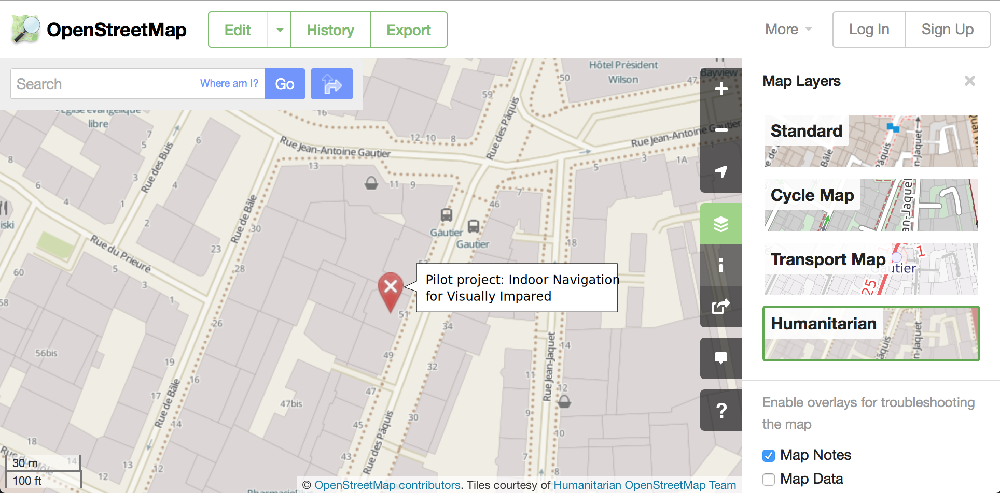

<a name="fig-location-map">Map Preview of a Milestone with Location</a>: Example on how Milestones could be visually represented on the map.

## <a name="future-location-exploration">Location based exploration of DACs & Campaigns</a>
Assuming each DAC, Campaing and Milestone has a as described in [Locations of DACs, Campaigns and Milestones](#future-location), all these entities could be searched on a map or on a 3D globe. In a DAC you could see to which places the delegations goes and in Campaign the user could see where the individual milestones took place.

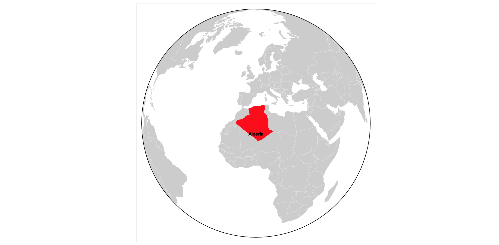

<a name="fig-location-exploration-campaign">Example of 3D visualisation to see where geographically a Campaign is making difference.</a> The concept image is taken from D3js [example page](https://bl.ocks.org/mbostock/4183330).

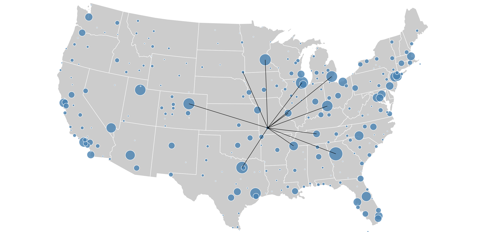

<a name="fig-location-exploration-dac">Example of 3D visualisation to see where  geographically does a DAC money go to.</a> The concept image is taken from D3js [example page](http://mbostock.github.io/d3/talk/20111116/airports.html).

## <a name="future-money-exploration">Money flow based exploration of DACs & Capaigns</a>

Giveth already has a lot of information that it is not using at all. By analysing the transactions, we can easily build graphs that would help people understand wheir the DACs money go through and where the Campaign money comes from. This could be an important ascpect that Givers could consider.

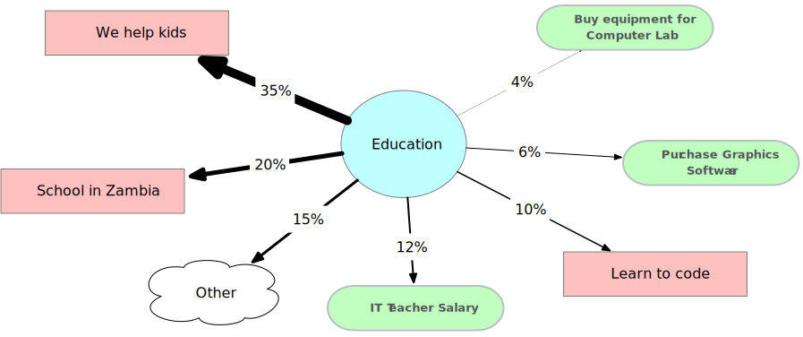

<a name="fig-money-flow-DAC">Where is the Education DAC spending money?</a> Each DAC could show what are the Campaigns and Milestones that are being funded. By clicking on the Other the user would get a table with all Campaigns and how much % of the DAC money was delegated to them. The blue elements are DACs, red are Campaigns and green Milestones.

Name | Type | Percentage |
-----|------|------------|
We help kids | Campaign | 35% |
Shool in Zambia | Campaign | 20% |
It Teacher Salary | Milestone | 12% |
Learn to code | Campaign | 10% |
Purchase Graphics Software | Milestone | 6% |
Buy equipment for Computer Lab | Milestone | 4% |
Internet bill February | Milestone | 3% |
Internet bill March | Milestone | 3% |
Internet bill April | Milestone | 3% |
Internet bill June | Milestone | 3% |
Installation of new language education software| Milestone | 2% |
IT olympics for High School Students | Campaign | 1% |

<a name="table-money-flow-DAC">Tabular view of all delegations.</a> 

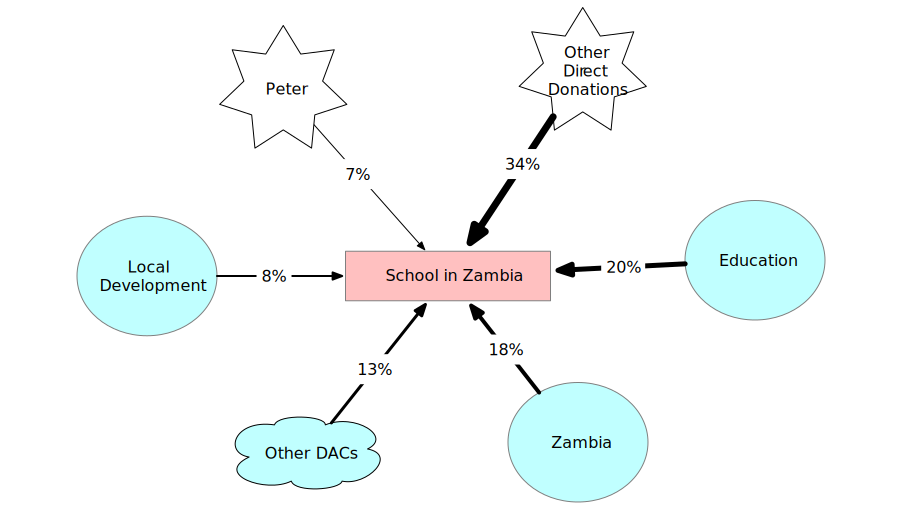

<a name="fig-money-flow-campaign">Where is the Campaign getting funding from?</a> The blue elements are DACs, red are Campaigns, green Milestones and white starts are users.

## <a name="future-money-conversion">Real-time and Historical Fiat Conversion</a>

For most People, even the ones already invested in crypto, it is difficult to evaluate how much money certain Ether amount is. Therefore, it would be great to provide a way where they can name a second (fiat) currency to Ether, that would be displayed and used. When donating, they could say "I want to donate 100 USD", instead of having to put in the value in Ether. Because we know when every transaction happen, we could easily (up to small error) display how much money any past donation was in fiat. This is especially necessary if Ether rapidly gains or loses in value as it becomes unclear how much money Campaign or DAC had and could lead to a confusion where Campaigns could look overfunded due to dramatic price increase.

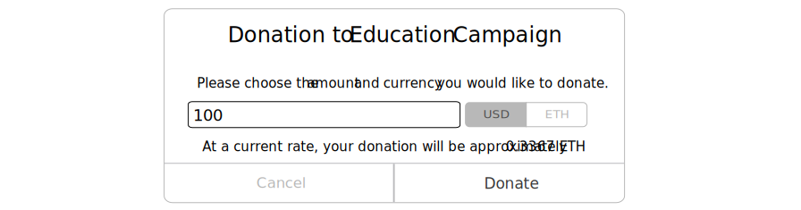

<a name="fig-fiat-donation">Donating amount of Ether expressed in fiat currency.</a> The actual donation would still be in Ether, but the value could be expressed in Ether based on recent average value from some major exchange.

Amount ETH | Est. Amount USD | Date             |  Name |
-----------|-----------------|------------------|-------|
Ξ0.551     | $155            | 2017-10-15 10:15 | Jen
Ξ1         | $312.15         | 2017-10-15 9:09  | perissology
Ξ1         | $298.11         | 2017-10-09 18:33 | Vojtech
Ξ2.531     | $100            | 2017-04-19 13:14 | Jim

<a name="table-fiat-dac-donation">Example how could past donation look with value estimated in fiat currency</a>. Note the significant price change between the last and first donation in the list.

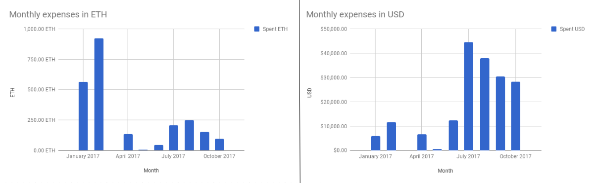

<a name="fig-fiat-spent">Comparison between monthly expenses in ETH and in USD</a>. Example on how it can be deceiving to use Ether vs how much money is actually spent. The data are from the [Giveth budget](https://docs.google.com/spreadsheets/d/1Qg7OiQ42jmsW3HCgtGA-v5NfxMEAR5SMo_oc7AtEqTE/edit?usp=sharing).

## <a name="future-categories">Categories for Milestones</a>

Currently it is not clear what a Campaign spent their money on. Should users decide to gain this insight, they would have to read through all the Milestones and maybe even then it would not be clear. Adding spending categories could help, both the Givers and the Makers, evaluate what were the money spent on. The list of categories should be predefined by Giveth and any new category should be created on request. The overhead for the user consists of selecting a category from a list when the milestone is being created. Of course, setting spending category should be optional.

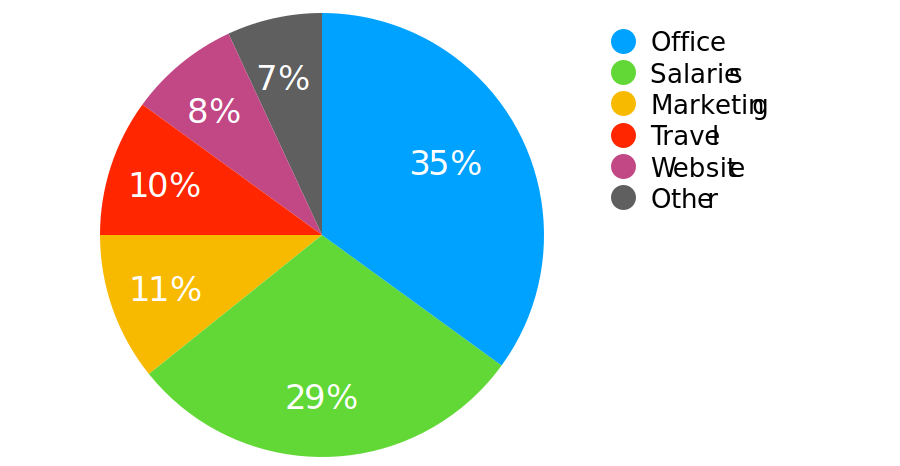

<a name="fig-categories">Overview of spending for a Campaign.</a> The aim is to provide Givers and Makers with better idea how is the Campaign spending the money.

## <a name="future-accounting">Accounting, Analytics, Business Intelligence</a>

Even now, the system contains enough information to provide some simple accounting, analytical and business intelligence information. This does not need to be part of the Giveth platform, but could be external tool. Note that these tools, however, work best if the value is expressed in relatively stable currency. One option is to use the [Real-time and Historical Fiat Conversion](future-money-conversion) concept. Below are some examples of what could be achieved.

- Daily cashflow of the Campaign
  - Donation frequency
  - Average amount
  - Target DAC audience
  - Donations and spendings per days/months/years
  - Spending categories (Assumes system has [Categories for Milestones](#future-categories))
  - Recurring Givers
- Spending breakdown at Milestone granularity
  - How much time it takes to raise funds for Milestone
- Future forecasts

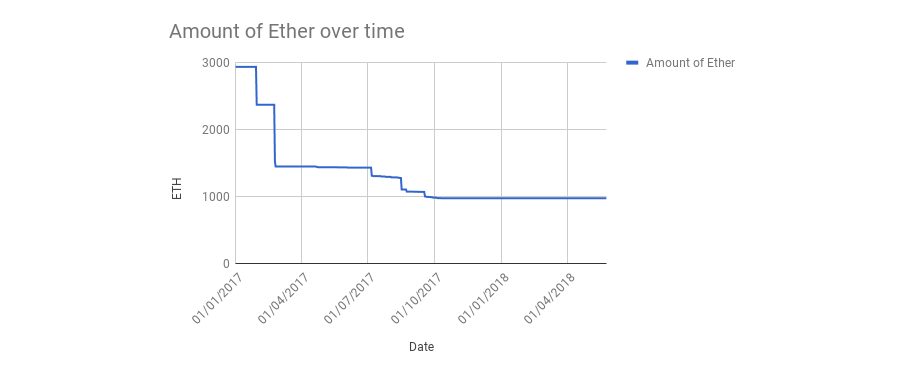

<a name="fig-analytics-overtime">Example of overtime balance graph.</a> The data are taken from [Giveth budget](https://docs.google.com/spreadsheets/d/1Qg7OiQ42jmsW3HCgtGA-v5NfxMEAR5SMo_oc7AtEqTE/edit?usp=sharing). Note that it does not reflect the well the actual value spent as Ether was 60 times lower before March 2017.

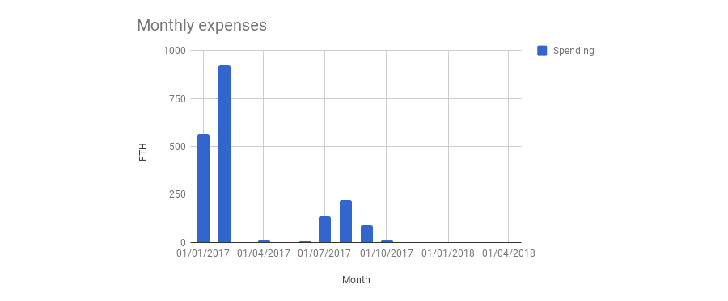

<a name="fig-analytics-monthly-spending">Example of monthly spending breakdown.</a> The data are taken from [Giveth budget](https://docs.google.com/spreadsheets/d/1Qg7OiQ42jmsW3HCgtGA-v5NfxMEAR5SMo_oc7AtEqTE/edit?usp=sharing).

## <a name="future-dac-governance">DAC Governance</a>

In the MVP there is one Delegate per DAC who is the owner and the only person that can delegate donation. The tension is that should the Delate be unavailable (temporarilly or permanently) the DAC will just accumulate donations that could be already making difference. In addition to that, bigger organisations will need multiple people being able to delegate money. One solution would be to enrich the Delegate role to be able to nominate other Delegates and build a governance system in the DAC. It could then be up to the settings of the DAC to define how many votes are necessary to:

1. Nominate new Delegate
2. Remove a Delegate
3. Change the DAC information (description, DAC's name,...)
4. Delegate Donations
5. Freeze a delegate

In reality we could then see DACs that have for example the following settings:

1. At least 51% of DAC's Delegates to nominate new Delegate
2. At least 70% to remove a Delegate
3. At least 30% to change the DAC information (description, DAC's name,...)
4. Everyone can delegate without need to vote (0 votes on donation delegation)
5. Everyone can freeze a delegate and the freeze time is 3 days

There is also a freeze action which can be called by any delegate to temporarily freeze another delegate. Such delegate can not do any action until he/she is unfrozen.

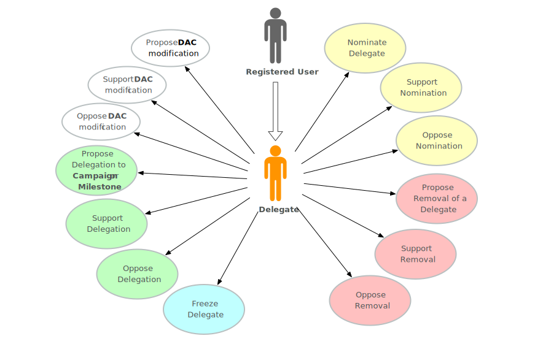

<a name="fig-dac-governance-delegate-usecase">Use case diagram for Delegate role if the DAC Governance is implemented.</a> The white actions are about changing the DAC information, green about donation delegation, blue are security actions, red are actions to remove delegate and the color yellow shows new delegate nomination actions.

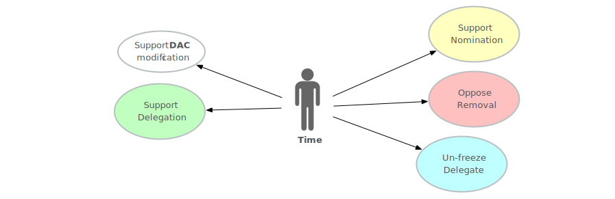

<a name="fig-dac-governance-time-usecase">Use case diagram for automatic actions if the DAC Governance is implemented.</a> Should there be delegates that did not vote yet, all their votes go to: Support the DAC modification, Support donation delegation, Support nomination of new Delegate, Oppose the removal of a Delegate. If the delegate is frozen for longer than the time limit, he/she is unfrozen.

## Campaign Governance

## Delegating from DAC to DAC

## Multiple Wallets

## Wallet Recovery Phrase

## Giver Portfolio

## Maker Portfolio

## DAC, Campaign, Milestone Search and Filtering

## Milestone Conversation

## Language Mutations

## Reputation

## Repetative Milestones

## Exploration based on Donations and Delegations

## Donation message

## Notifications

### In App

### External

## If This Then That (IFTTT) Integration
