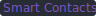
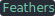
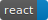

# Roadmap for Giveth Product
This chapter, details the Giveth Product roadmap until the platform is released = open for general public on the Main Ethereum Network. The aim is to reach this state on 1st of March 2018.

## As Soon as Possible
**Contributors** -
Allowing external contributors to meaningfully join the application development. We need to create and mark issues suitable for external contributors (=fully defined an clear), write contribution guidelines and continuisly review and merge the contributors pull requests. The responsibles are:

- `@perrisology` for Smart Contracts and Plugins
- `@perrisology` and `@satya` for Feathers
- `@satya` and `@vojtech` for Reactjs

**User Experience Review** -
Reviewing the platform screen by screen and improving the overall user experience. The workflow would consist of proposal for improvement, review of the proposal and implementation

## Mainnet for Giveth - (2017 November 23)
To get live on the Ethereum Main Network the following is steps are necessary:

**MiniME Integration**

 -
Write and add MiniME plugin to Liquid Pledging. Add display of the token to UI which would allow the Delegates and Campaign managers to name the token they will issue and to all the Givers see how much of what tokens they have. We agreed that tokens are issued only in the following cases:

1. Giver donates to Campaign he receives Campaign tokens
2. Giver donated to DAC, the DAC delegated the donation to Campaign and the delegation is commited. Only then the Giver receives both the DAC tokens and Campaign tokens. When we allow delegation from DAC to DAC, only the DAC to which the Giver donated in the first place will issue tokens for him.

**Whitelist of Plugins**
 -
Creating a white list of plugins that are allowed to be added to the Liquid Pledging for the Giveth Platform.

**Whitelist of Reviewers**

 -
Creating a white list of Reviewers that can be used and modifying the UI to support it https://github.com/Giveth/giveth-dapp/issues/47.

**Whitelist of Campaign Managers**

 -
Build a list of addresses ther can create Campaigns. Any Campaign that is not created with these addresses will not be visible in the Giveth Platform.

**Whitelist of Delegates**

 -
Build a list of addresses ther can create DACs. Any DAC that is not created with these addresses will not be visible in the Giveth Platform.

**Role Definitions**

 -
Adding the Campaign Manager and Milestone Manager role. The roles should comply with the [Product Definition](https://wiki.giveth.io/documentation/product-definition/) especially with the [Milestone State Diagram](https://wiki.giveth.io/documentation/product-definition/#product-definition-fig-milestone-statediagram).

**Gas Price input**

 -
Allow users to set a gas price for any blockchain transaction.

**Verify Feathers Data Permisions**
 -
Verify that there are no permission problems in the Feathers js.

**Donate without Registering**

Add functionalitty to the Donate button which would give you an option to donate through MyEtherWallet (just like on our [website](https://giveth.io)). The smart contracts need to be altered as well to allow donations from un-registered users.

**In House Testing**

 -
All team members get to test on the test network and provide us with a feedback. `@vojtech` will facilitate the testing and collecting feedback.

**Deploy Contracts to Main Network**
 -
Deploy and verify all the smart contracts and plugins to the Main Ethereum Network.

**Deploy Feathers.js**
 -
Deploy final clean production version of Feathers js.

**Deploy DApp UI**
 -
Deploy final version of UI and freeze it on Netlify.

## First Campaign - (2018 January 15)
**DAC Approval for Adding Campaign**

 -
The DAC has to aprove that it wants to be associated with a Campaign. For now we will only do that in the frontend by not showing the unapproved Campaigns in DAC.

**External Notifications**

 -
Adding email notifications to the DApp and hooking it to events like new donations, new delegation , milestone status change and others.

**Propose New Milestones (offchain)**

 -
Allow anyone to propose a new milestone to a Campaign. The proposal will not be visible to anyone except for Campaign Manager.

**On-boarding 1st Campaign** -
A dedicated person who will be in contact with the first Campaign to use our system. This includes gathering requirements, guided introduction to the platform and collecting feedback.

**Tutorials, Videos, Documentation** -
Preparing tutorials, video and other documentation for the launch based on the feedback from the first Campaign.

**Link to Dashboard/Milestone Workflow in Campaign**

 -
Milestone Workflow added to the Campaign (all the buttons right in the milestones).

**User Customisation - Logo, Page Color**

 -
Allow users to customise their Campaign page by changing background color and adding their logo.

**Mist Integration**

 -
Allow signing up with Mist Address and interacting with the app through Mist.

**Metamask Integration**

 -
Allow signing up with Meatamask Address and interacting with the app with Meatamask.

**Allow Executing Transactions from MEW** -

Add to every transaction button option to redirect to MyEthereumWallet with the data and addresses pre-filled.

**Testing**

All team members and the Campaign get to test on the test network and provide us with a feedback. `@vojtech` will facilitate the testing and collecting feedback.

## First DAC - (2018 February 15)
**Gathering DACs (and Campaigns)** -
On-going process of gathering and on-boarding other DACs and Campaigns.

**Multiple Delegates in DAC**

 -
Allow multiple delegates that can propose delegation and can approve/reject the delegation (just the green actions in the [DAC governance diagram](https://wiki.giveth.io/documentation/future/fig-dac-governance-delegate-usecase))

## Official Release - (2018 March 1)
**Gathering DACs and Campaigns**
On-going process of gathering and on-boarding other DACs and Campaigns for the main release.

## At earliest opportunity
**Verify Feathers**
 -
Fully verify feathers models and restrictions

**Tests**

 -
Add frontend and backend tests.

**Anonymous Donations from Exchanges**
 -
Allow donating from exchanges and emitting the donation tokens.

**Mutual DAC an Campaign Linking**

 -
Allow bi-directional linking of DACs and Campaigns (currently only Campaigns can link with DACs).

**Token Support**

 -
Support using the ERC20 and ERC223 tokens in the platform for all the actions.
